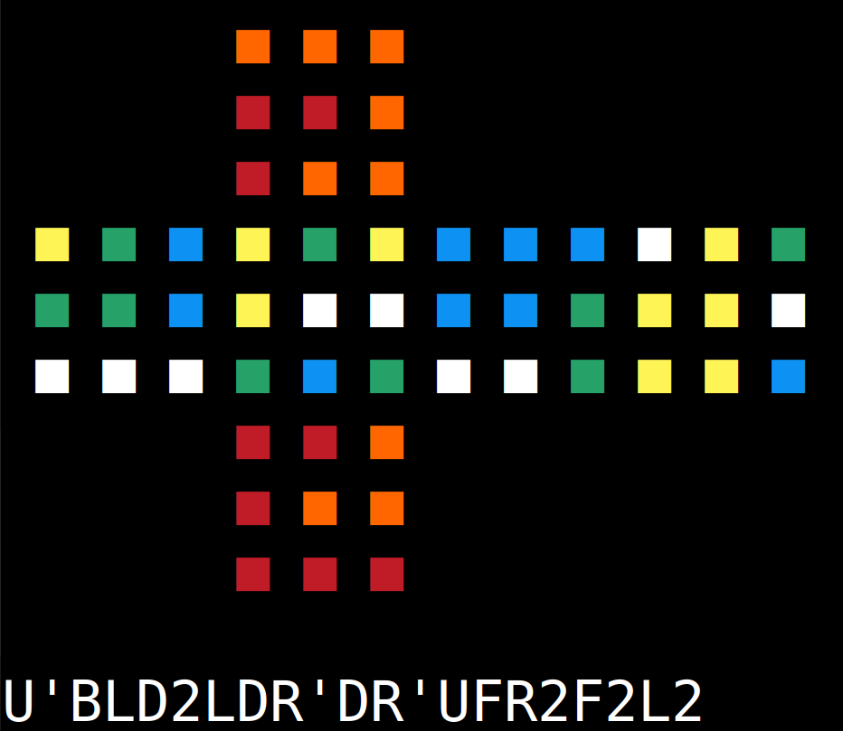

## Terminal Rubik's Cube Solver

**A Linux terminal-based solver for Rubik's Cube.**

This project provides a lightweight graphical interface for solving a Rubik's Cube in the terminal. It features real-time updates, a 2D cube representation, color-coded text, and a 3D ASCII spinning cube.
The program uses a Kociemba-inspired algorithm to generate optimal moves for solving the cube.




## **Key Features**

1. **2D Cube Representation**
   - The program displays a color-coded 2D view of the Rubik's Cube to help visualize the current state.
  
2. **Step-by-Step Solution**
   - By pressing `s`, users can step through the solving process one move at a time, with real-time updates of the cube's state.

3. **3D ASCII Spinning Cube**
   - Press `c` to view a rotating 3D ASCII representation of the Rubik's Cube, showing the current color state from all angles.

4. **Color-Coded Text**
   - The cube's colors are represented with text-based colors in the terminal for clarity.

---

## **Prerequisites**

To compile this project, ensure the following are installed on your Linux system:


1. **C Compiler**  
   GCC is required to compile the C code:  
   ```bash
   sudo apt install gcc
   ```

2. **GNOME Terminal**.
   
3. **Ubuntu on Xorg**
   for representing the 3D ASCII cube without issues, Choose `Ubuntu on Xorg` and login.


---

## **How to Run**

1. **Clone the Repository**
   ```bash
   git clone https://github.com/a7mddra/Rubik.git
   cd Rubik
   ```

2. **Run Makefile**
   ```bash
   make
   ```

3. **Run the App**
   ```bash
   ./main
   ```

   - input your cube's color state in this order: `U R F D L B`. For example:
     ```
     RRRRRRRRRBBBBBBBBBWWWWWWWWWOOOOOOOOOGGGGGGGGGYYYYYYYYY
     ```
   - Press `s` to step through the solution and update the 2D cube representation.
   - Press `c` to display a 3D ASCII spinning cube of the current color state.

---

## **Example Gameplay**

```
       ■ ■ ■
       ■ ■ ■
       ■ ■ ■
 ■ ■ ■ ■ ■ ■ ■ ■ ■ ■ ■ ■ 
 ■ ■ ■ ■ ■ ■ ■ ■ ■ ■ ■ ■ 
 ■ ■ ■ ■ ■ ■ ■ ■ ■ ■ ■ ■ 
       ■ ■ ■
       ■ ■ ■
       ■ ■ ■

GWGRRRWORYBWYBOBBBBBBRWRGWRYBWOOYYOOWWOGGGOYRRGOWYYYGG
```
```
       ■ ■ ■
       ■ ■ ■
       ■ ■ ■
 ■ ■ ■ ■ ■ ■ ■ ■ ■ ■ ■ ■ 
 ■ ■ ■ ■ ■ ■ ■ ■ ■ ■ ■ ■ 
 ■ ■ ■ ■ ■ ■ ■ ■ ■ ■ ■ ■ 
       ■ ■ ■
       ■ ■ ■
       ■ ■ ■

s
```
```
       ■ ■ ■
       ■ ■ ■
       ■ ■ ■
 ■ ■ ■ ■ ■ ■ ■ ■ ■ ■ ■ ■ 
 ■ ■ ■ ■ ■ ■ ■ ■ ■ ■ ■ ■ 
 ■ ■ ■ ■ ■ ■ ■ ■ ■ ■ ■ ■ 
       ■ ■ ■
       ■ ■ ■
       ■ ■ ■

U'
```

---

## **Demo**

You can check out a demo of the run in action by visiting this [LinkedIn post](https://www.linkedin.com/posts/a7mddra_i-solved-rubiks-cube-in-terminal-using-c-activity-7275835356967501826-d0LO?utm_source=share&utm_medium=member_desktop).

In the post, I showcase how the app runs in the terminal.

Feel free to take a look at the video to see the app in real-time!

---

## Thanks to

- @muodov for the Kociemba C version.

---
